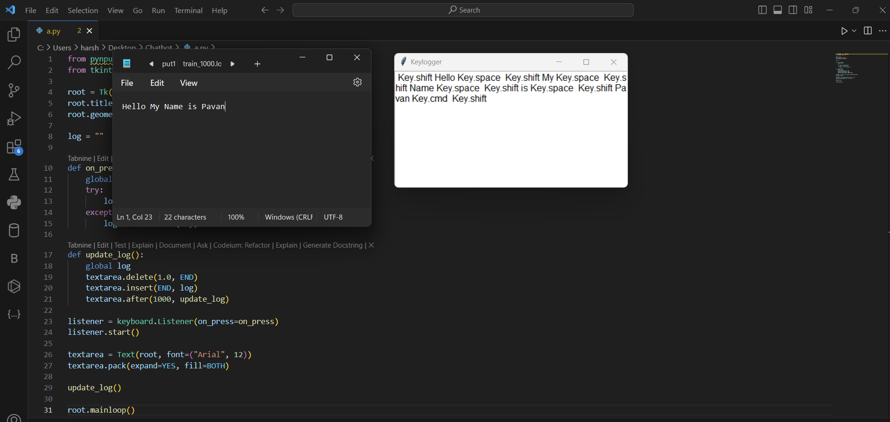

<div align="center">

# Keystroke Logger — Educational Demo

### A minimal, *visible* keystroke viewer built to learn input listeners and the tkinter event loop


</div>

---

> ### ⚠️ Educational use only — read before running
> This is a learning demo that shows how an operating system surfaces keyboard
> events to a program, and how a GUI refreshes on a timer. It runs **locally and
> in plain sight**: a window opens and displays *your own* keystrokes as you
> type into your own machine.
>
> **Only run it on a computer you own, or one you have explicit written
> permission to test on.** Capturing another person's keystrokes without their
> informed consent is unethical and is a crime in most jurisdictions. Do not use
> this to monitor anyone else, and do not deploy it on systems you do not own.
> The author provides this for education and accepts no liability for misuse.

## What it is (and isn't)

| It **is** | It **is not** |
| :--- | :--- |
| A ~30-line teaching example | A surveillance tool |
| Visible — opens a titled window | Hidden, stealthy, or persistent |
| Local — prints to its own screen | Anything that sends data anywhere |
| A demo of `pynput` + `tkinter` | Production software |

It deliberately has **no** stealth, no persistence, no storage, and no network
code. It simply reads key events and draws them in a window — nothing leaves the
machine.

## How it works

The whole program is [`C1.py`](C1.py), and it shows two ideas working together:

1. **An event listener.** `pynput.keyboard.Listener` runs on a background thread
   and calls `on_press` for each key. Printable keys append their character;
   special keys (Shift, Space, …) append their name.
2. **A GUI refresh loop.** A `tkinter` `Text` widget re-draws the collected text
   once a second using `widget.after(1000, ...)` — the standard way to schedule
   repeated work on tkinter's main loop without blocking it.

That pairing — a callback producing data on one thread, a UI polling it on
another — is the real lesson here.

## Run it

```bash
git clone https://github.com/harshakalluri1403/keylogger.git
cd keylogger

pip install pynput          # tkinter ships with most Python installs
python C1.py
```

A window titled **"Keylogger"** opens. Type into it (or anywhere, since the
listener is global) and watch the text appear. Close the window to stop.

> On macOS you must grant the terminal/Python **Accessibility** and **Input
> Monitoring** permissions for `pynput` to receive key events — another reminder
> that the OS gates this capability on purpose.

<p align="center">

</p>

## What you could learn from here

- Swap the global listener for input bound only to the window, so it captures
  nothing outside the app.
- Explore how different platforms expose (and restrict) input events.
- Study why antivirus and operating systems treat global key hooks as sensitive.

## Tech stack

Python · [pynput](https://pynput.readthedocs.io/) · tkinter (standard library)
